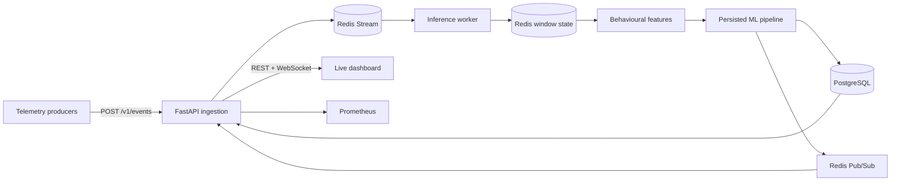

# Real-Time Cloud Anomaly Monitor

[](https://github.com/mubarakk-dev/real-time-cloud-anomaly-monitor/actions/workflows/ci.yml)

A containerised, production-oriented telemetry monitoring system that performs asynchronous behavioural-window inference, persists predictions and alerts, streams live updates, and exposes operational metrics through a dashboard.

This project demonstrates an end-to-end ML systems workflow rather than only serving a prediction endpoint: ingestion, durable queuing, stateful stream processing, feature calculation, model inference, persistence, observability, security controls, testing, and deployment are separate, inspectable components.

## System capabilities

- Protected FastAPI ingestion endpoint for raw service telemetry.
- Redis Streams event queue with a dedicated consumer worker.
- Redis-backed, per-service behavioural window state.
- Configurable late-event watermark before window closure.
- Persisted scikit-learn preprocessing and Random Forest inference pipeline.
- Validation-selected anomaly threshold and model-version fingerprint.
- PostgreSQL prediction and alert history.
- WebSocket live-prediction channel.
- Streamlit operations dashboard with live scores and alerts.
- Prometheus application and inference metrics.
- Structured JSON logging, health checks, and readiness checks.
- Docker Compose deployment with isolated API, worker, Redis, PostgreSQL, dashboard, and Prometheus services.
- Unit, integration, smoke, CI, and Locust load-test support.

## Architecture



The API accepts only observable fields. Labels, incident IDs and anomaly categories are absent from the ingestion contract and cannot enter inference.

## Run the complete system

Requirements: Docker Desktop with Docker Compose.

```bash
cp .env.example .env
```

Replace both secrets in `.env`, then start the stack:

```bash
docker compose up --build -d
docker compose ps
```

Endpoints:

| Service | URL |
|---|---|
| Dashboard | http://localhost:8501 |
| API documentation | http://localhost:8000/docs |
| API readiness | http://localhost:8000/ready |
| Prometheus metrics | http://localhost:8000/metrics/ |
| Prometheus UI | http://localhost:9090 |

Start a continuous telemetry producer from the project root:

```bash
python -m venv .venv
.venv\Scripts\python -m pip install -r requirements.txt
.venv\Scripts\python -m scripts.producer --continuous
```

The producer reads `INGEST_API_KEY` from the environment. When using the unchanged demonstration defaults, it uses the same local-only value as Compose.

Run the end-to-end smoke test:

```bash
.venv\Scripts\python -m scripts.smoke_test
```

Stop the services without deleting persistent data:

```bash
docker compose down
```

## API example

```bash
curl -X POST http://localhost:8000/v1/events \
  -H "Content-Type: application/json" \
  -H "X-API-Key: $INGEST_API_KEY" \
  -d '{
    "timestamp": "2026-08-20T12:00:00Z",
    "service": "payment-service",
    "event_type": "payment",
    "response_time_ms": 742.5,
    "cpu_usage": 87.2,
    "memory_usage": 79.4,
    "status_code": 500,
    "log_level": "ERROR"
  }'
```

The endpoint responds with HTTP `202 Accepted`. Classification occurs asynchronously when the service window closes.

## Development checks

```bash
.venv\Scripts\python -m pip install -r requirements-dev.txt
.venv\Scripts\ruff check .
.venv\Scripts\python -m pytest -q
```

Load testing:

```bash
.venv\Scripts\locust -f locustfile.py --host http://localhost:8000
```

## Engineering decisions

- Ingestion and inference are decoupled so API latency does not include model processing.
- Redis Streams retain accepted events until a worker acknowledges successful handling.
- Redis stores active window state; PostgreSQL stores completed decisions.
- A watermark permits limited out-of-order arrival before a window closes.
- A distributed Redis lock prevents two consumers from finalising the same window.
- The model artifact includes preprocessing, feature order, window duration and threshold.
- The artifact hash is recorded with every decision for traceability.

See [architecture](docs/ARCHITECTURE.md), [operations](docs/OPERATIONS.md), [security](docs/SECURITY.md), and [model provenance](docs/MODEL.md).

## Scope

The repository is designed as a deployable systems portfolio project and can be run end to end on any Docker host. Production use would still require organisation-specific identity integration, TLS termination, secret management, backup policy, capacity testing, alert routing, service-level objectives, and validation against real operational telemetry.
